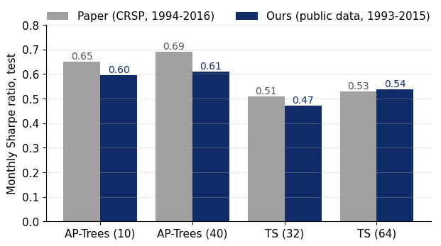
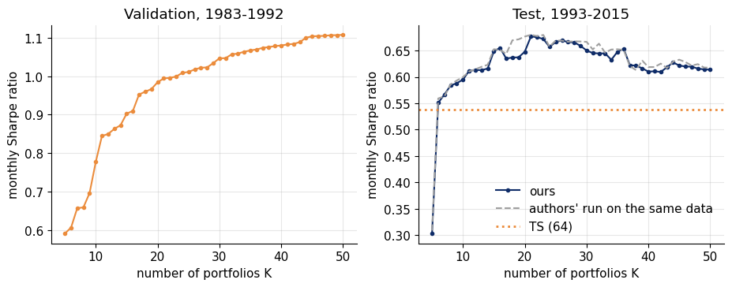
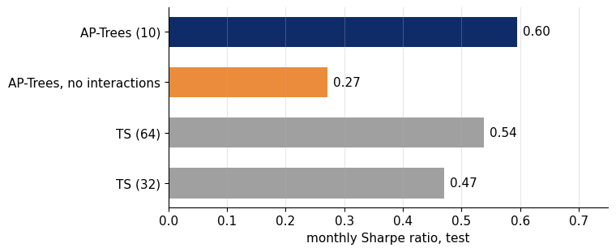
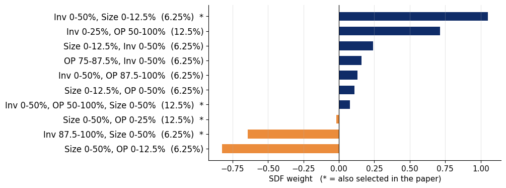
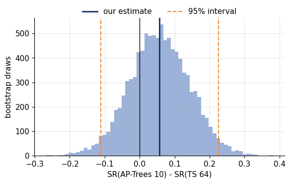

# Forest through the Trees: Reproduction of AP-Trees

**Research Seminar: Data Analysis in Finance, HSE University**

**Paper:** Bryzgalova, S., Pelger, M., & Zhu, J. (2025). Forest through the Trees: Building Cross-Sections of Stock Returns. *The Journal of Finance*, 80(5), 2447--2506.

**Group 7:** Arsentyev Arseniy, Grebennikova Polina, Kantemirova Elizaveta, Pushkarev Vladislav

## What this project does

We reproduce the main example of the paper -- AP-Trees on size, operating profitability and investment -- in Python and compare the results with triple-sorted portfolios. Specifically:

- Build 1,507 AP-Tree portfolios from three characteristics (size, OP, investment) at depth 4.
- Prune them with LASSO (LARS path) and mean-variance shrinkage to select 10--40 test assets.
- Compare out-of-sample Sharpe ratios of AP-Trees vs. triple sorts (Table I of the paper).
- Show that interaction nodes drive the result (Figure 8).
- Add bootstrap significance tests and checks with official Fama-French factors (not in the paper).

## Main results

| Basis assets   | Test SR (ours) | Test SR (paper) | XS-R2 of FF5 |
|----------------|:--------------:|:---------------:|:-------------:|
| AP-Trees (10)  |      0.60      |      0.65       |     0.14      |
| AP-Trees (40)  |      0.61      |      0.69       |     0.72      |
| TS (32)        |      0.47      |      0.51       |     0.91      |
| TS (64)        |      0.54      |      0.53       |     0.88      |

The ranking of the paper reproduces: AP-Trees achieve a higher Sharpe ratio than triple sorts, and the Fama-French five-factor model explains most of the sorted portfolios but only a small part of the AP-Tree cross-section.



The test Sharpe ratio stops rising after 15--20 portfolios:



Without interaction nodes the Sharpe ratio falls by more than half:



The SDF buys small low-investment firms and sells small high-investment firms:



The advantage over triple sorts is not statistically significant in one cross-section:



## How to run

### Requirements

Python 3.9+. Install dependencies:

```bash
pip install -r requirements.txt
```

### Running the notebook

```bash
jupyter notebook AP_Trees_reproduction.ipynb
```

Run all cells in order. The first run downloads the data automatically (~1 GB from Dropbox + Fama-French factors from Kenneth French's library), which takes 5--10 minutes depending on your connection. Subsequent runs use the cached files in `data/`.

## Data

**No data files are included in this repository.** All data is downloaded automatically by the notebook on the first run:

1. **Stock-level data** from [Markus Pelger's website](https://sites.google.com/view/mpelger/code-and-data) (the authors' public data release for the paper). The files contain stock returns, market caps, and characteristics (size, operating profitability, investment) with random noise added to returns due to the WRDS/CRSP licence.

2. **Fama-French factors** from [Kenneth French's Data Library](https://mba.tuck.dartmouth.edu/pages/faculty/ken.french/data_library.html) (3-factor and 5-factor monthly files).

### Note on the data

- The public data has noise added to returns, so our Sharpe ratios (e.g. 0.60) are slightly below the paper's numbers (0.65), but match the authors' own run on the same public data.
- The year labels in the authors' files (`yy` column) are shifted by one year relative to the real dates (`date` column). We use `date` for correct timing. See Section 2 of the notebook for the verification.

## Repository structure
